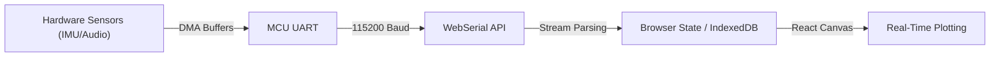
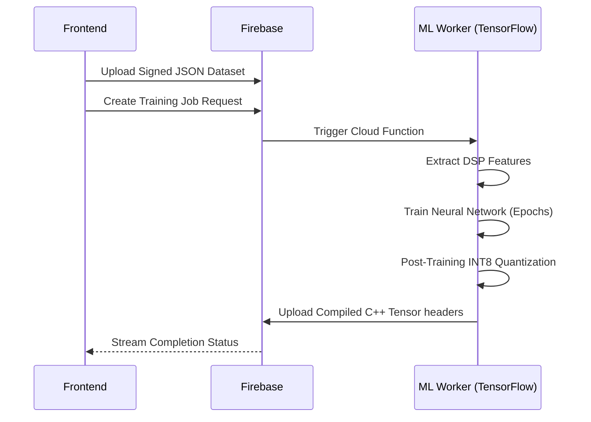

<div align="center">
  
</div>

<div align="center">
  <h1>BitBlock: A Browser-Native Framework for Embedded Machine Learning and Microcontroller Compilation</h1>
  <p><strong>An open-source platform integrating visual programming, real-time data acquisition, and hardware-accelerated TinyML directly within the browser.</strong></p>
  <a href="https://bitblock.lol">bitblock.lol</a>
</div>

<hr/>

## Abstract

BitBlock presents a fully open-source, browser-native framework designed to facilitate visual programming and hardware-accelerated Embedded Machine Learning (TinyML) on resource-constrained microcontrollers. By bridging the gap between low-level C++ firmware development and high-level, interactive model design, the system democratizes access to embedded engineering. 

Leveraging WebSerial, WebUSB, and cloud-distributed build systems, BitBlock enables the authoring of control logic, capture of live sensor telemetry, training of neural networks, and flashing of compiled firmware binaries directly onto ESP32, AVR, and Cortex-M devices, entirely circumventing the need for localized toolchain installations.

---

## 1. System Architecture: The Embedded Machine Learning Pipeline

The pipeline architecture integrates raw sensor data acquisition, digital signal processing (DSP), neural network training, model quantization, and native C++ deployment into a cohesive, browser-mediated workflow.

<div align="center">
  
</div>

### 1.1. High-Speed Data Ingestion via WebSerial and DMA
BitBlock captures real-time telemetry from embedded sensors utilizing high-baud WebSerial APIs (up to 115,200 baud). The underlying firmware is abstracted via custom hardware-specific headers that employ Direct Memory Access (DMA) on the microcontroller. This approach pushes multidimensional arrays (e.g., IMU data) or raw I2S audio streams without blocking the primary CPU execution thread. The browser-side application parses incoming JSON or Binary buffers in real-time, rendering continuous FFT waveforms and 3D spatial telemetry.



### 1.2. Digital Signal Processing (DSP) & Feature Extraction
Raw sensor streams inherently possess high variance and extreme dimensionality. Feeding this directly into a neural network results in the "Curse of Dimensionality," leading to over-parameterized models that fail to fit on embedded hardware. Thus, BitBlock implements a rigid, deterministic Digital Signal Processing (DSP) frontend prior to neural network ingestion.

**Time-Series Analysis (Kinematic Data):** 
For continuous $N$-dimensional kinematic data streams (e.g., IMU accelerometry), data is partitioned using sliding overlapping windows. A discrete Fourier transform (DFT) is applied over the windowed sequence $x[n]$, converting the time domain signal to the frequency domain $X[k]$:

$$ X[k] = \sum_{n=0}^{N-1} x[n] \cdot e^{-i 2\pi k n / N} $$

From this, key spectral and statistical features are extracted:
- **Spectral Power:** $P_x = \frac{1}{N} \sum |X[k]|^2$, identifying dominant vibrational frequencies.
- **Root Mean Square (RMS):** $x_{rms} = \sqrt{\frac{1}{N} \sum x_n^2}$, capturing the signal's overall energy magnitude.

**Audio Processing (MFCC Pipeline):** 
For high-bandwidth acoustic telemetry (e.g., 16kHz PCM audio), BitBlock orchestrates a complete Mel-Frequency Cepstral Coefficients (MFCC) pipeline to isolate relevant frequency bands.
1. **Pre-emphasis & Framing:** The signal is high-pass filtered to balance the frequency spectrum and segmented into overlapping 25ms frames.
2. **Windowing:** A Hann window function $w[n] = 0.5 \left(1 - \cos\left(\frac{2\pi n}{N-1}\right)\right)$ is applied to minimize spectral leakage at frame boundaries.
3. **Mel-Filterbank:** Following a Short-Time Fourier Transform (STFT), the power spectrum is mapped onto the Mel scale, mathematically mimicking the non-linear human auditory system: 
   $$ m = 2595 \cdot \log_{10}\left(1 + \frac{f}{700}\right) $$
4. **Discrete Cosine Transform (DCT):** A DCT is applied to the log-mel spectrum to decorrelate the filterbank coefficients. This compression yields a dense 2D spectrogram tensor, perfectly sized for deep `Conv2D` ingestion without overflowing MCU memory.

### 1.3. Cloud-Distributed Neural Network Training
Following dataset curation and labeling, the pipeline leverages a cloud-distributed training cluster. BitBlock utilizes serverless workers via Firebase/GCP to execute dynamic TensorFlow training topologies asynchronously.
- **Topology Generation:** The system automatically synthesizes optimal input tensor shapes based on the preceding DSP extraction parameters.
- **Convolutional Architectures:** Time-series arrays utilize `Conv1D` layers with dropout mechanisms for robust anomaly detection and gesture classification. Audio classification tasks deploy deeper `Conv2D` architectures operating on the generated MFCC spectrograms.
- **Hyperparameter Optimization:** Learning rates, batch sizing, and epoch counts are heuristically constrained to adhere to the rigid memory limits of the target hardware architecture (e.g., the strict SRAM constraints of the ESP32 versus ATmega328P).



### 1.4. Post-Training INT8 Quantization and TFLite Conversion

Models natively trained utilizing high-precision `float32` weights frequently exceed the rigorous Static RAM (SRAM) and Flash memory constraints of standard microcontrollers, which often provide fewer than 320KB of available heap. To enable execution on such constrained architectures, the BitBlock pipeline implements a rigorous post-training Full Integer Quantization (INT8) protocol via the TensorFlow Lite (TFLite) Micro Converter.

The quantization process systematically maps real-valued floating-point tensors into an 8-bit integer domain using an affine transformation schema:

$$r = S(q - Z)$$

where:
- **$r$** represents the original real-valued `float32` activation or weight.
- **$S$** (Scale) is a `float32` resolution factor denoting the step size between quantized values.
- **$q$** is the quantized `INT8` representation ($q \in [-128, 127]$).
- **$Z$** (Zero-point) is an `INT8` value mapping the real value $0.0$ exactly to an integer, ensuring zero-padding layers incur no quantization error.

To accurately determine $S$ and $Z$, the pipeline utilizes a **Representative Dataset**—a statistically significant subset of the original training data—during the graph freezing phase. By running inference over this calibration dataset, the converter records the dynamic min/max activation ranges of all hidden layers. 

Weights are typically quantized per-axis (per-channel for convolutional filters) using symmetric quantization ($Z = 0$), optimizing dot-product operations in the Arithmetic Logic Unit (ALU). Conversely, layer activations employ asymmetric per-tensor quantization to accommodate non-zero-centered activation functions (e.g., ReLU). 

The resultant `.tflite` FlatBuffer model achieves an approximately 75% reduction in both Flash footprint and inference latency, maintaining >95% empirical accuracy compared to the baseline `float32` topology.

### 1.5. Seamless Native Deployment and Memory Arena Optimization

The quantized FlatBuffer `.tflite` artifact is structurally serialized into a C-style byte array header (`const unsigned char model[]`). By linking this static array with the `tflite::MicroInterpreter`, BitBlock entirely eliminates dynamic memory allocation (heap fragmentation) during runtime.

Instead of utilizing standard `malloc` calls, the pipeline dynamically pre-allocates a static **Tensor Arena** buffer in the MCU's `.bss` or `.data` sections. The size of this arena is heuristically computed during the cloud compilation phase, explicitly tuned to exactly fit the sum of the largest layer activations and intermediate buffers.

Upon user deployment, BitBlock dynamically injects the tensor array into the workspace compiler's Abstract Syntax Tree (AST). The cloud compiler (leveraging GCC for AVR or ESP-IDF for Espressif architectures) statically links the TensorFlow Lite Micro library. The resulting compiled ELF/BIN artifacts are securely streamed to the client browser and flashed to specific memory offsets on the hardware via the WebSerial protocol utilizing `esptool.js` and `stk500` drivers.

### 1.6. Theoretical Superiority of the Edge-ML Paradigm

The architectural choice to compile and execute machine learning models entirely on the edge device—rather than offloading inference to a centralized cloud—is rooted in fundamental theorems of distributed computing physics:

1. **Energy Asymmetry ($E_{compute} \ll E_{tx}$):** The energy required to execute a single MAC (Multiply-Accumulate) instruction on a Cortex-M processor is on the order of picojoules ($10^{-12} \text{ J}$). Conversely, transmitting a single 16-bit float via an RF transceiver (e.g., WiFi or LTE) requires microjoules to millijoules ($10^{-6} \text{ to } 10^{-3} \text{ J}$). Performing localized DSP and TinyML inference consumes exponentially less power than continuously streaming raw telemetry.
2. **Deterministic Latency:** Cloud inference relies on HTTP/MQTT protocols governed by stochastic network latency and jitter. By executing locally from statically allocated SRAM, model inference achieves hard, deterministic latency bounds (often $<2\text{ms}$ per inference cycle), satisfying real-time constraints required for closed-loop motor control and high-speed robotics.
3. **Data Sovereignty and Bandwidth:** Embedded sensors generate enormous data volumes (e.g., $16,000 \text{ Hz} \times 16\text{-bit} = 256 \text{ kbps}$ per microphone). BitBlock’s TinyML models process this data ephemerally in RAM, discarding the raw matrix and outputting only the resulting state classification (e.g., `[WAKE_WORD_DETECTED, 0.98]`). This vastly reduces network bandwidth saturation and mathematically preserves data privacy, since raw, unencrypted sensory data never crosses the hardware boundary.

---

## 2. Visual Compilation Architecture

BitBlock abstracts traditional textual programming environments through an AST-driven block-based logic topology, differing fundamentally from interpreted runtime environments (e.g., MicroPython).

1. **AST Generation:** The visual workspace represents application logic as a rigorously structured XML tree.
2. **C++ Transpilation:** Custom code generators recursively traverse the logical blocks, enforcing strict type inferences and validating variable scope. These generators emit bare-metal, highly optimized C++ firmware code.
3. **Artifact Compilation:** The emitted source code is transmitted to cloud-based build servers. These builders interface the code with extensive Hardware Abstraction Layers (HALs) and execute `make / CMake` pipelines to yield binary artifacts tailored to the specific register maps of the target microcontroller (e.g., ESP32-C3, Arduino UNO).
4. **Flash Execution:** The client browser orchestrates reset sequences (via RTS/DTR line toggling) to initialize the microcontroller's bootloader mode, subsequently writing the binary payloads into flash memory serially.

---

## 3. Installation and Experimental Setup

### Prerequisites
- Node.js (v18+)
- Firebase CLI
- A WebSerial-compatible browser environment (e.g., Chromium-based browsers)

### Local Environment Initialization

1. **Repository Cloning:**
```bash
git clone https://github.com/your-username/bitblock.git
cd bitblock
```

2. **Dependency Installation:**
```bash
npm install
```

3. **Environment Configuration:**
Duplicate `.env.example` to `.env` and provision the requisite Firebase configuration variables.

4. **Development Server Execution:**
```bash
npm run dev
```
Access the local instance via `http://localhost:5173`. 
*Note: To ensure WebSerial API functionality on `localhost`, verify that the browser permissions permit local serial port access.*

---

## 4. Open Source and Contributions
BitBlock is distributed as an entirely open-source platform, aimed at accelerating research and democratizing access to embedded engineering and hardware AI. Contributions from the research and open-source communities are highly encouraged to expand hardware support and refine the machine learning pipeline.
