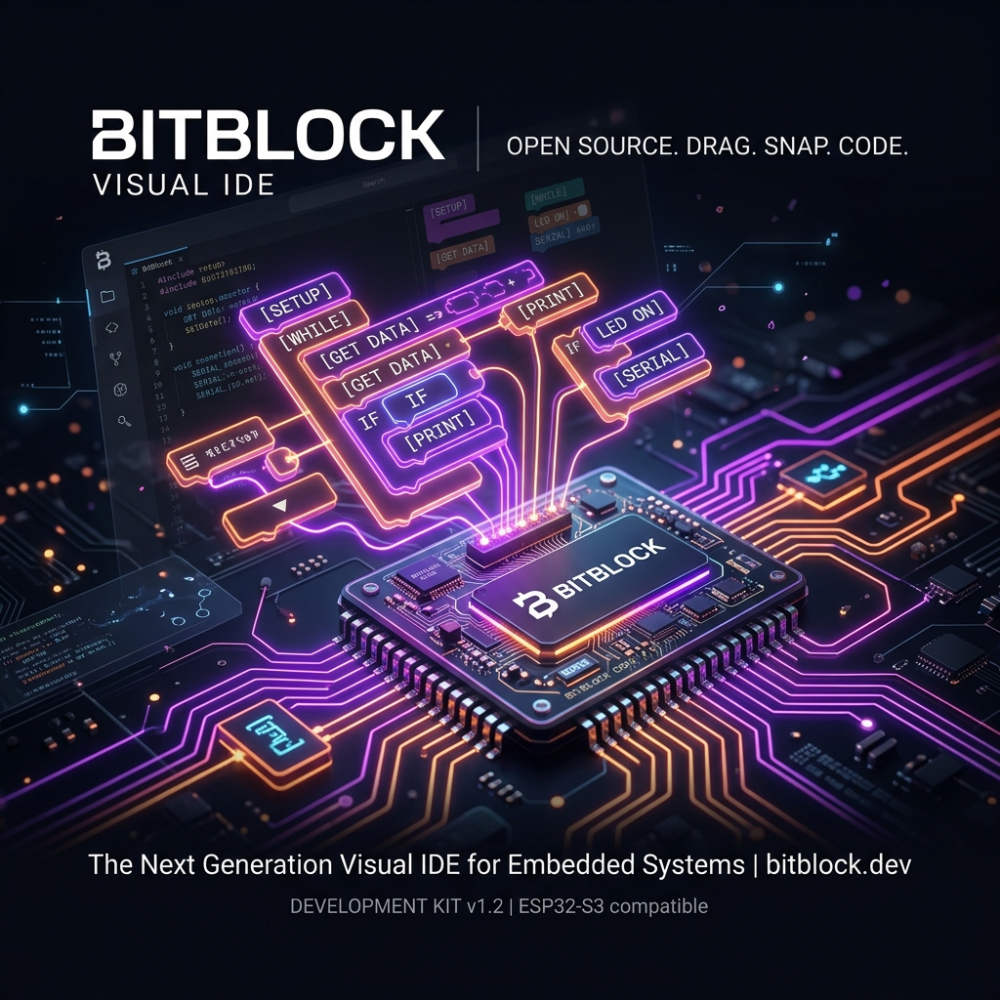
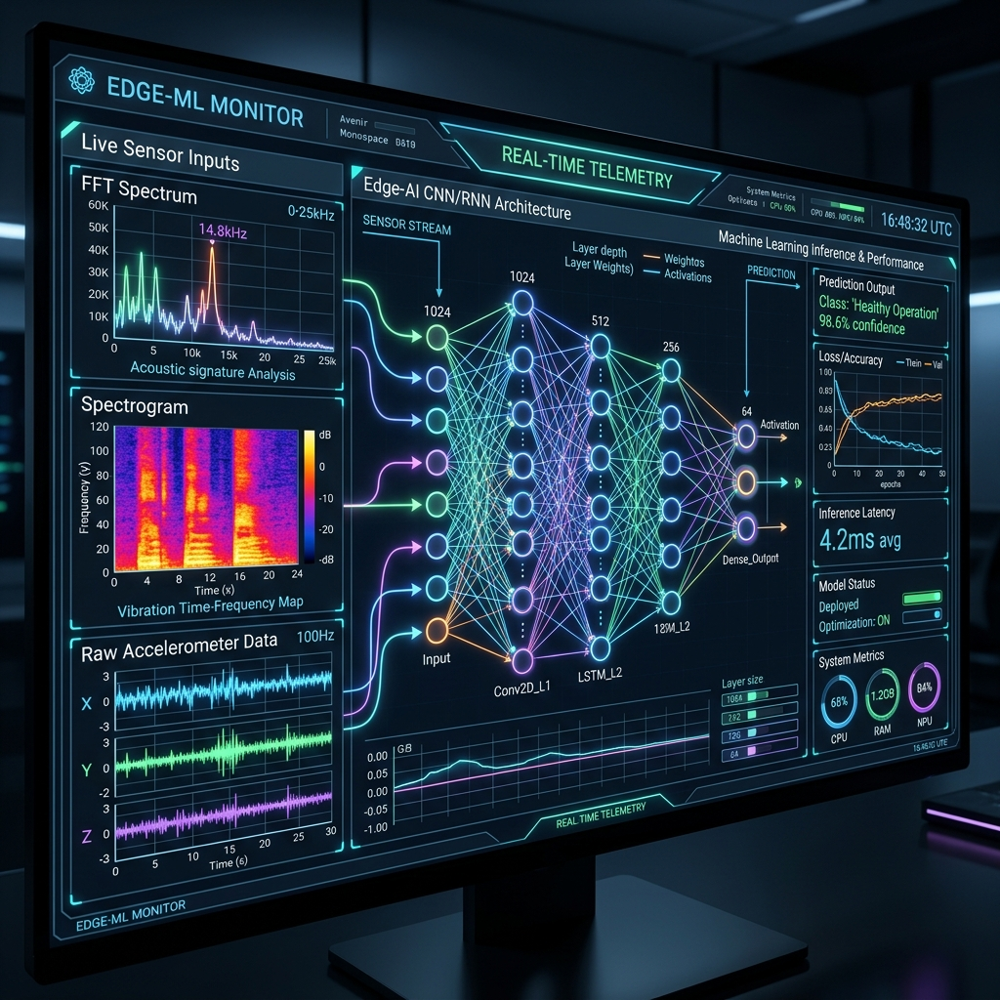
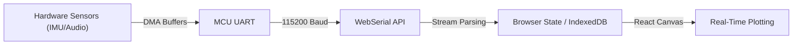
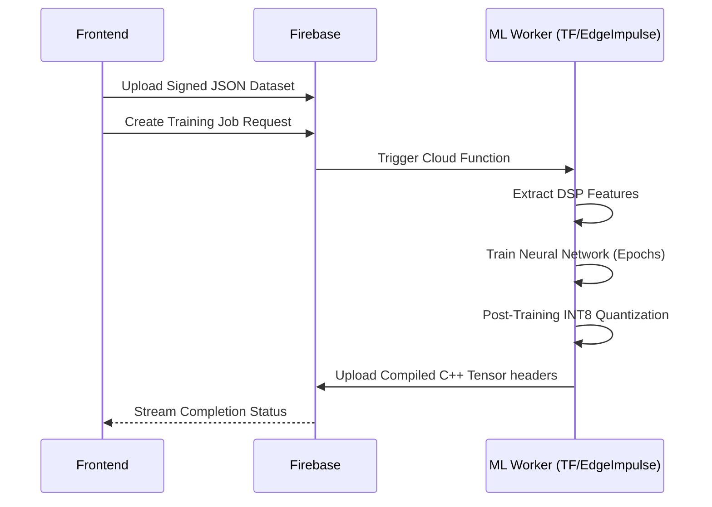

<div align="center">
  
</div>

<div align="center">
  <h1>BitBlock</h1>
  <p><strong>A Free, Open-Source Visual IDE & Embedded Machine Learning Pipeline for Microcontrollers</strong></p>
  <a href="https://bitblock.lol">Live Platform: bitblock.lol</a>
</div>

<hr/>

BitBlock is an advanced, fully open-source IDE that enables visual programming and hardware-accelerated Embedded Machine Learning (TinyML) natively in the browser. It bridges the gap between low-level C++ firmware development and high-level, interactive model design. 

By leveraging WebSerial, WebUSB, and cloud-distributed build systems, BitBlock enables developers to write logic, capture live sensor telemetry, train neural networks, and flash compiled firmware binaries directly onto ESP32, AVR, and Cortex-M devices—all without leaving the browser.

---

## 🧠 The Embedded Machine Learning Pipeline (Deep Dive)

The core technical differentiator of BitBlock is its end-to-end TinyML pipeline. The architecture seamlessly integrates raw sensor data acquisition, digital signal processing (DSP), neural network training, model quantization, and native C++ deployment.

<div align="center">
  
</div>

### 1. High-Speed Data Ingestion (WebSerial + DMA)
BitBlock captures real-time data from embedded sensors using high-baud WebSerial APIs (up to 115,200 baud). The hardware firmware is abstracted via custom driver headers that utilize Direct Memory Access (DMA) on the microcontroller to push accelerometer arrays or raw I2S audio streams without blocking the primary CPU thread. The browser parses these JSON/Binary buffers in real-time, plotting continuous FFT waveforms and 3D telemetry.



### 2. Digital Signal Processing (DSP) & Feature Extraction
Before passing raw data to neural networks, BitBlock implements high-efficiency signal processing. 
- **Time-Series Analysis:** For inertial data (IMU), spectral analysis windows the continuous data into overlapping segments, calculating spectral power, RMS, and skewness to condense multi-axis high-frequency noise into clean features.
- **Audio Processing (MFCCs & Spectrograms):** For audio streams, Mel-Frequency Cepstral Coefficients (MFCC) algorithms convert raw PCM audio matrices into 2D visual spectrograms, drastically reducing the dimensionality of the neural network input layer while emphasizing human-audible frequency bands.

### 3. Cloud-Distributed Neural Network Training
Once a dataset is labeled and constructed, it is pushed to our cloud training cluster. BitBlock utilizes serverless workers via Firebase/GCP to run dynamic TensorFlow and Edge Impulse training topologies asynchronously.

- **Topology Generation:** The system determines optimal input shapes based on the chosen DSP extraction outputs.
- **1D/2D Convolutions:** Time-series arrays leverage `Conv1D` blocks with dropout layers for robust anomaly detection and gesture classification. Audio targets deploy deeper `Conv2D` architectures acting on the generated MFCC spectrogram images.
- **Hyperparameter Optimization:** Learning rates, batch sizing, and training cycles (epochs) are heuristically constrained based on the limits of the target hardware architecture (e.g., SRAM limits of the ESP32 vs ATmega328P).



### 4. Post-Training Quantization (INT8)
Models trained in high-precision float32 are fundamentally too large for standard microcontroller SRAM (which may only have 320KB available). The pipeline aggressively invokes TensorFlow Lite Micro optimizations to quantize the model weights down to INT8 representations. This reduces flash footprint and RAM utilization by ~75% while maintaining >95% of the original inference accuracy. 

### 5. Seamless Native Deployment
The quantized model, along with its associated DSP scaling algorithms, is exported natively as a highly optimized `.h` C++ header block. 
When the user triggers a deployment, BitBlock dynamically injects the model array into the workspace compiler AST (Abstract Syntax Tree). The cloud compiler (leveraging GCC for AVR or ESP-IDF for Espressif) statically links the TensorFlow Lite Micro library.
The compiled ELF/BIN artifacts are securely streamed back to the browser and flashed into specific memory offsets on the hardware board natively over the WebSerial protocol using `esptool.js` and `stk500` drivers.

---

## 🏗️ Visual Compilation Architecture

BitBlock replaces traditional text environments with an intuitive block-based logic topology. Under the hood, this is fundamentally different from interpreted languages (like MicroPython).

1. **AST Generation:** The visual workspace (powered by Google Blockly) represents application logic as a heavily structured XML tree.
2. **C++ Transpilation:** Custom code generators recursively walk the logic blocks, validating variable scope and strictly typed inferences. The generators output bare-metal C++ firmware code.
3. **Artifact Compilation:** The generated source code is transmitted to cloud builders. The builders wrap the code against extensive hardware abstraction layers (HALs) and run `make / CMake` to generate binary artifacts targeting the specific register maps of the selected chip (ESP32-C3, ESP32-S3, Arduino UNO, etc.).
4. **Flash Execution:** The browser issues reset sequences (RTS/DTR toggling) to place the MCU into bootloader mode and sequentially writes the binary payloads into flash memory.

---

## 🚀 Getting Started

### Prerequisites
- Node.js (v18+)
- Firebase CLI
- A WebSerial-compatible browser (Chrome, Edge, Opera)

### Running Locally

1. **Clone the repository:**
```bash
git clone https://github.com/your-username/bitblock.git
cd bitblock
```

2. **Install dependencies:**
```bash
npm install
```

3. **Configure Environment Variables:**
Copy `.env.example` to `.env` and fill in your Firebase configuration keys.

4. **Start the Development Server:**
```bash
npm run dev
```
Navigate to `http://localhost:5173`. 

*Note: For WebSerial to function on `localhost`, ensure your browser allows local serial port access.*

---

## 🤝 Contributing & Community
BitBlock is entirely open source. There are no paid walls, subscription limits, or enterprise lock-ins. Our goal is to democratize embedded engineering and hardware AI.

Contributions are heavily encouraged! Check out the Issues tab for areas needing help. If you want to build custom Blockly component drivers for specific I2C sensors, submit a Pull Request to our Marketplace directories!

---

**Built for the Open Hardware Community.** <br/>
[bitblock.lol](https://bitblock.lol)
